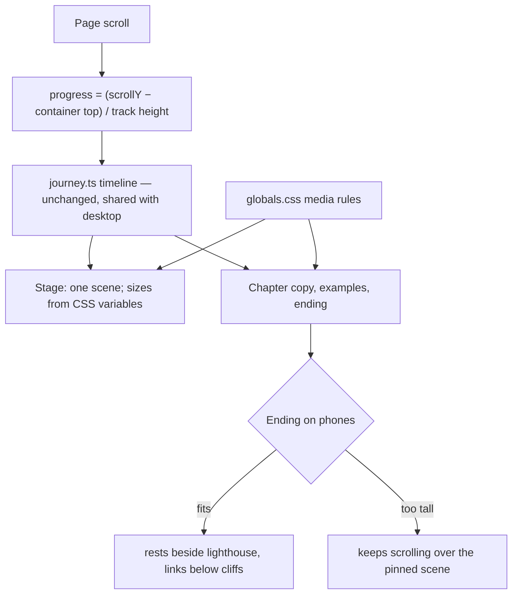

# Mobile journey — handoff and working notes

Living document. Read this first after a context reset, then `MOBILE-JOURNEY.md` (the brief).
Update it at every checkpoint: what changed, what was learned, what is next.

Last updated: 2026-09-15, after the skyfall interlude (moon fade and meteors).

## 1. Where things are

| Thing | Value |
| --- | --- |
| User's checkout (untouched) | `/Users/gmr/Documents/iris-personal-site`, branch `cursor/personal-site-03d5`, HEAD `eb160b5` |
| Implementation worktree | `/Users/gmr/Documents/iris-personal-site-mobile-journey`, branch `codex/mobile-journey` (local only, never pushed) |
| Brief | `docs/briefs/MOBILE-JOURNEY.md` (checklists, phase notes, design revision note) |
| Research evidence | `docs/evidence/mobile-journey-research/` (MANIFEST, checksums) |
| Phase 2 evidence | `docs/evidence/mobile-journey-checkpoint/` |
| Figma revision evidence | `docs/evidence/mobile-journey-figma-revision/` (incl. real Safari screenshot) |
| Check script | `scripts/journey-check.mjs` (capture / compare / sweep; headless Chrome, no deps) |
| Local preview for Simulator | `pnpm build`, then `python3 -m http.server 4318 --bind 127.0.0.1 --directory out` → `http://127.0.0.1:4318/` |
| Simulator | iPhone 17 Pro Max, iOS 26.2, UDID `398CF31F-7902-471B-91CD-7ED34926858F` (user prepared it). The iPhone 17 simulator gave SpringBoard crash loops once; avoid unless reset. |
| Temporary (may vanish) | Session scratchpad: desktop baseline PNGs, build copies. Regenerate the desktop baseline from a build of `eb160b5` with `capture … 1440x900`. |

### Commits on `codex/mobile-journey`

| Commit | What |
| --- | --- |
| `00ad978` | Phase 0: evidence preserved, baseline recorded, check script |
| `aba7329` | Phase 1: one Journey at every size, CSS phone framing, svh measurement |
| `eae39df` | Phase 2: examples slot, copy band above the boat, lighthouse, ending, safe areas, landscape |
| `1a36d5c` | User Figma design: new copy, 29/18px type, 8px spacing, glow, controls row, ending inside the lighthouse scene |
| `c748366` | Safari toolbar fix: ending clearance adds `(100lvh - 100svh)` |
| `a320310` | "Six Ways to See One File" link hidden on phones (`phones: false`) |
| `4d94bc6` | Design checkpoint: this handoff document and brief status update |
| `3f785db` | Skyfall interlude: moon fades behind clouds, meteors fall down-left between chapters two and three |
| (next) | Meteor shower runs into chapter three: six staggered meteors behind its label and question, ending as the body types |

## 2. How the phone journey works now



- **One layout.** `page.tsx` mounts `Journey` only. `JourneyStacked.tsx` is unmounted, kept until the Phase 3 reading presentation replaces it.
- **Measurement.** Sticky stage is `h-svh`. A `data-journey="track"` div of `(SCROLL_SCREENS − 1) × 100svh` defines travel; progress never uses `innerHeight`. ResizeObserver marks geometry dirty; `scrollTo` only restores position when orientation flips.
- **Framing by CSS, not JS.** `.journey-stage` custom properties hold sprite sizes (desktop values reproduce the old inline sizes exactly). Rules:
  - `(max-width: 767px) and (orientation: portrait)` — compact phone framing, overlays, type 29px / 18px, controls row, lighthouse `--lighthouse-vx: 0.6`, cliffs `--arrival-cliffs-vx: 0.36`.
  - `… and (max-height: 599px)` — type 24px / 17px (smallest phones).
  - `… and (min-height: 600px)` — chapter one's paragraph narrows beside the small moon.
  - `(orientation: landscape) and (max-height: 500px)` — wide framing, text in the right column.
- **Examples** (questions, milestones): portrait slot via inline `--example-base` plus CSS `!important` overrides (x 0.15, 66% wide, top 46%, measured through the 1.2× compact zoom).
- **Chapter copy band**: `.journey-chapter` flex column from 96px to 16px above the boat (`calc(13svh + 9.1vw + 16px)`); chapter two drops below the big moon when it fits.
- **Ending on phones**: `.journey-ending-scene` sits after the track with `margin-top: calc(-100svh + 96px)`, so it rises into place at arrival. Bottom padding `calc(13svh + 7.6vw + 16px + (100lvh - 100svh))`. The panel is a flex column with a min-height so links and footer settle above the boat; when content is taller, the container grows and the ending scrolls over the still-pinned scene. Desktop keeps the pinned `.journey-ending`.
- **Copy** lives in `src/content/site.ts`. Links have an optional `phones: false`.
- **Test hooks**: `data-journey` = container, stage, scene, track, boat, moon, lighthouse, example (`data-text`), copy (`data-chapter`), intro, ending, ending-scene.

## 3. User decisions to respect

- Copy changes apply everywhere; layout, sizes, spacing and glow are phone-only. Desktop must stay visually unchanged apart from copy.
- 8px spacing scale (4, 8, 16, 24, 32, 48, 64, 72, 80, 96). Question 29px pixel font, body 18px serif, 24px question → body.
- Ending lives in the lighthouse scene (no separate section). Footer kept small under links. "Onwards." removed. "Six Ways" link off phones (may be dropped entirely later).
- Desktop's soft glow (`.scrim`) behind text blocks, not letter halos.
- Phones under 600px tall: 24px / 17px type.
- Lead: "Read as text" control below the intro and reduced-motion default to reading mode are Phase 3, not done yet. Do not merge or push without explicit approval.
- User preferences (CLAUDE.md): mermaid diagrams for complex architecture, atomic commits, tick brief checkboxes only with evidence, ask before push/PR, apply review feedback with judgement.

## 4. How to verify (what actually worked)

```bash
pnpm build && pnpm typecheck && pnpm lint && pnpm test
python3 -m http.server 4318 --bind 127.0.0.1 --directory out
CDP_PORT=9700 node scripts/journey-check.mjs sweep http://127.0.0.1:4318/ out.json 440x956
CDP_PORT=9701 node scripts/journey-check.mjs capture http://127.0.0.1:4318/ shots 440x956 ch1-copy=2.5 arrival=29 end=end
CDP_PORT=9702 node scripts/journey-check.mjs compare <baseline-dir> <new-dir>
```

- Run one sweep size per command (three sizes in one call hit the 10-minute tool limit). Give each run its own `CDP_PORT`.
- Sweep reports travel reversals (must be 0), examples found (15), copy/example/boat/lighthouse collisions, horizontal overflow, and ending checks at arrival and page end.
- Then check the ending in **real Safari** in the Simulator (see lessons).

## 5. Lessons learned (the expensive ones)

1. **Headless Chrome has no toolbar, so `lvh == svh`.** Real Safari with a collapsed toolbar shows the taller large viewport; the page ended 40px early and the credits sat on the boat. Every sweep passed. Always check the ending in Simulator Safari, scrolled to the very bottom.
2. **Don't claim "by construction".** The first research claimed a wider crop kept desktop proportions; measuring refuted it. Measure the property you claim.
3. **Measure the right quantity.** rAF frame intervals are not work time; distinct elements over 60 frames are not per-frame counts; a MutationObserver with an empty callback swallows records before `takeRecords()`.
4. **`html { scroll-behavior: smooth }`** silently breaks scripted `scrollBy`; set `scrollBehavior = "auto"` in tests and use `behavior: "instant"`.
5. **Capture noise is real.** Frozen CSS animations still vary under machine load (departure and arrival bands, thousands of pixels). Compare captures taken under the same conditions before calling a diff a regression.
6. **Sweep "copy over moon" can be a bounding-box false positive** (full-width question line spans the moon's column). Look at the screenshot.
7. **Simulator gestures on iPhone 17 Pro Max:** start swipes at y ≤ 700pt. Starting at 880pt hits Safari's tab bar and opens the tab overview. A fast 600pt swipe (0.08s) moves roughly 3–5 screens; the journey is about 29 screens. Don't send two gestures in parallel.
8. **Unlayered CSS in `globals.css` beats Tailwind utilities; `!important` beats inline styles.** That is how phone overrides work without touching desktop classes.
9. **Scripted multi-edits:** use Python replacements with an exact-count assert. Check substring counts (one assert failed because a string appeared twice).
10. **Tooling traps:** `pnpm typecheck` fails before the first build (generated `LayoutProps`); Turbopack rejects a symlinked `node_modules` (use `pnpm install --offline`); preserved `.tsx` evidence breaks lint (store as `.txt`); CDP script-disabled captures hang on page-context awaits (use a plain delay); killed servers report exit 144.
11. **Content edits in `site.ts` change desktop too.** Ask where a change should apply before editing shared copy.
12. **AskUserQuestion worked well for design forks** (fit fallback, footer, glow, small phones). Offer a recommended option with the trade-off stated.

## 6. Known limits and next steps

- Legibility: text crosses the moon in chapter three and in chapter two on narrow phones; sweep flags chapter one by bounding box only.
- "go" wraps alone in the ending heading at 393–440px.
- Not verified on a physical iPhone; Chrome on iPhone untested.
- Accessibility unchanged: chapter copy and examples are not reachable by screen readers at load (Phase 3). Reduced motion still animates (Phase 3).
- Phases 3–6 of the brief not started. Codex review of the Phase 2 checkpoint was requested; later commits are additional user-directed design work.
- **Skyfall interlude (implemented, desktop and phones):** between the last chapter-two milestone and chapter three's copy. Timing spec first, in `docs/SCROLL-CHOREOGRAPHY.md`: the pause gets 2.37 screens (14.74–17.11), the journey is now 32 screens (31 of travel), and every later beat moved 2 screens later. No story progress values changed. Code: `skyfall`, `meteorRain` and `meteorWindows` in `journey.ts`; moon opacity reaches 0 at 35% of the pause. User feedback: three quick meteors felt random and stopped in empty sky, so `meteorRain` now runs from the moon disappearing (15.57 screens) through chapter three's label and question, ending exactly when its body starts typing (progress 0.4908, 17.33 screens). Six overlapping windows keep about two meteors in the sky, with no gaps (tested). Meteors are in `Stage.tsx` (mirrored sprites `falling-star-1..3.png`, measured `frame`s in `sprites.tsx`, drawn after the clouds, `--meteor-scale` 1.8 on phones). The user dropped the art in the *original checkout's* `public/sprites/` (still untracked there, filenames `falling-stars.png`, `falling-starts-2.png`, `falling-stars-3.png`); copies were renamed into the worktree, checksums identical.

- **Dock community sprite (desktop and phones):** `dock-complete.png` (user art: the adult, the child and a young android sitting together, representing humans and AI as a community) replaces the separate dock, adult and child sprites. One `Pixel` (`dockComplete`, measured frame `[57, 117, 1029, 949]`); planks aligned to the old 79% line with `translateY(-74.6%)`. Desktop keeps the adult's former size and position (`--dock-w: 50.5cqh`, `--dock-left: calc(11% - 18.8cqh)`); phones follow the user's mockup (`--dock-w: 78%`, `--dock-left: -24%`, dock cut at the left edge). The art was again dropped in the user's main checkout and copied (checksum identical). Known: at 320×568 the intro paragraph's last line sits just above the adult's head.

- **Production merge (2026-09-15):** production (`origin/cursor/personal-site-03d5`, GitHub, auto-deployed by Cloudflare Pages) had 8 commits after `eb160b5`: new copy, milestone notes shown with each desktop marker, the Chapter 3 rewrite (HCI milestone removed, so 14 examples now), the Rolling Context link, and the beam pointing left toward the boat. Merged with production copy winning; the stacked-layout boat animation (`docs/MOBILE-BOAT-PATCH.md`) is superseded. Production is the deploy branch: push to `origin cursor/personal-site-03d5` (see `DEPLOYMENT.md`).
- **IRIS alignment (phones):** the adult's head centre (50.34% across the dock frame) sits under the centre of the "I" of IRIS: `--dock-left: calc(max(24px, safe-left + 16px) + 14.3px - 39.27%)`. Measured 0px off at 440, 393 and 320 wide. Desktop unchanged.
- Known after merge: on phones the leftward beam crosses the ending paragraph (semi-transparent, readable).
- After merge, 320×568 regressed: production's milestone notes (Rolling Context, Six Ways) and the longer Chapter 3 body overlapped the boat. Phones under 600px tall now use a 16px body and 15px milestone notes with an 8px gap (re-swept before deploy).

### Lessons from the skyfall work
- Asset drops may land in the user's main checkout, not the worktree. Search both.
- Anything placed inside the zoomed camera near the top of the sky renders higher than its `top` suggests (1.2× phones, 1.4× desktop around the boat). Measure the rendered box before tuning timing.
- Paint order matters: sprites before the cloud `Layer` in the DOM are hidden behind clouds.
- `fadeWindow` never fades a window whose start is ≤ 0 or end is ≥ 1 (built for the intro and ending). Used on local 0→1 fractions it left the first meteor visible from page load for the whole journey. Meteors use `meteorVisibility`, which is zero outside the shower; a regression test sweeps the whole timeline.
- Tie decorative beats to story events, not arbitrary fractions: the shower ends on `chapterPhases` typing start, so it hands over to the chapter instead of stopping in empty sky.
- Changing `SCROLL_SCREENS` breaks tests and tools that hard-code screen positions (`TRAVEL` in the check script, the open-water test). Update them with the timing spec.
