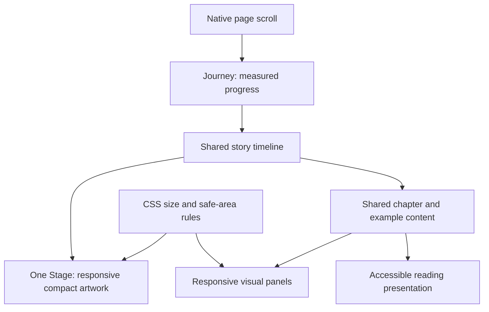

# Mobile journey: implementation and review brief

Status: planned; implementation has not begun.

Owner: Opus (implementation). Reviewer: Codex in the original website task.

Prepared from repository commit `e267916efd5306d35809974f9329a65986f32371` on `cursor/personal-site-03d5`. Recheck the checkout before starting; do not assume this remains the latest commit.

## 1. Outcome and scope

Give phones the continuous ocean journey that defines the desktop website: introduction, departure, chapter context, floating examples, breathing room, storm, and lighthouse arrival. Preserve readable copy and the working desktop presentation.

This is one bounded experiment with sequential phases, not several unrelated projects. Use one brief so implementation decisions, evidence, and review status stay together. Each phase should end in a small, reversible commit. Do not treat completion of a phase as permission to publish.

The user wants progress tonight if practical, but has not made a deadline a reason to accept regressions. If the full journey cannot meet the gates below, leave the deployed version intact and report the experiment's state. A simpler improvement that animates the boat in the current stacked mobile presentation is a possible later fallback, **not part of this implementation**. Do not silently switch to that scope.

### Included

- One shared journey/timeline/artwork system, with responsive presentation rules.
- Compact phone composition, continuous scroll-driven movement, and visible narrative examples.
- Stable scroll measurement, phone-safe controls, short-screen treatment, and readable ending.
- Accessible equivalents for the story and a usable reading presentation.
- Desktop regression checks and clearly bounded mobile verification.

### Excluded

- Fixing iPhone volume gain. Play/pause works; volume gain is a known separate issue the user explicitly deferred.
- New artwork, rewritten biography, new music, or changing existing outbound links.
- A new animation library, canvas/WebGL rewrite, CSS scroll-timeline migration, or a second story engine.
- Broad performance cleanup without evidence.
- Deployment, pushing, merging, or opening a PR before the user authorizes that step after review.

## 2. Why this direction

The current `page.tsx` mounts both `Journey` and `JourneyStacked`, hiding one with CSS. `JourneyStacked` renders six separate Stage snapshots. The desktop Journey already owns continuous progress; `Stage` already supports compact sprite sizing. Reuse those boundaries instead of maintaining two independent journeys.

Opus's follow-up evidence **reversed the initial recommendation to crop a wider scene**. Its crop sweep reported clipped boats and examples. Compact keeps more of departure understandable without adding a pan track. This is a reason to start with compact, not proof that compact is complete.

Key limitations from the follow-up:

| Evidence | Consequence for implementation |
| --- | --- |
| Initial 47px boat measurements used `compact=false` | Do not use those measurements to reject compact framing. |
| Compact currently suppresses all floating examples | A test with zero rendered examples cannot pass their visibility gate. |
| 320×568 chapter-two screenshot puts copy into the boat | Phone overlay placement needs measured fit, not a blanket desktop position. |
| Compact arrival clips the lighthouse slightly at 393px and overlaps ending copy | Adjust arrival framing and let ending information continue in page flow. |
| Simulated 125%/200% zoom was a smaller viewport, not actual Safari zoom | Reproduce real enlargement separately; do not claim zoom coverage from viewport sizes. |
| Initial 8–15ms values were animation-frame intervals, not work duration | Use the replacement traces only within their stated limits. |
| Throttled Chrome traces identify scripting/style costs, but not iPhone performance | Profile the chosen implementation; do not infer physical-phone smoothness. |

## 3. Evidence and reference map

### Project sources

- [Current timing specification](../SCROLL-CHOREOGRAPHY.md)
- [Asset specification](../ASSET-SPEC.md)
- `src/app/page.tsx`: current layout selection.
- `src/components/journey/Journey.tsx`: scroll measurement, panels, route map.
- `src/components/journey/JourneyStacked.tsx`: current mobile content and fallback behavior.
- `src/components/journey/Stage.tsx`: scene layers, compact sizing, markers, boat.
- `src/components/journey/Panels.tsx`: shared text, typing layout, milestone details, ending.
- `src/components/journey/Soundtrack.tsx`: one shared player and controls.
- `src/lib/journey.ts`: authoritative story phases, visibility windows, camera and scene state.
- `src/app/globals.css`: animations and reduced-motion rules.
- `tests/journey.test.mjs`: existing story timing checks.

### Opus local package (temporary; preserve before relying on it)

Root: `/private/tmp/claude-501/-Users-gmr-plugins/1f6a2b00-d99a-4be0-9a90-17c6c6afcfe3/scratchpad/`

- [Follow-up evidence report](/private/tmp/claude-501/-Users-gmr-plugins/1f6a2b00-d99a-4be0-9a90-17c6c6afcfe3/scratchpad/prototype-evidence.html)
- [Earlier decision report](/private/tmp/claude-501/-Users-gmr-plugins/1f6a2b00-d99a-4be0-9a90-17c6c6afcfe3/scratchpad/journey-on-iphone.html)
- `evidence/`: screenshots and JSON measurements, including `a11y.json`.
- `harness.mjs`, `proto-src/`, `proto/`, `base/`: inspect to identify the actual patch and reproduction procedure; do not blindly copy or execute them.
- Important screenshots: `compact-393x852-departure.jpg`, `compact-320x568-ch2-panel-moon.jpg`, `compact-393x852-arrival.jpg`, `compact-320x568-arrival.jpg`, and the corresponding crop/example comparisons.

The HTML refers to `shots/` and `data/`, but the local files are in `evidence/`. Fix links in a preserved copy, leaving the originals untouched. Do not copy `chrome-profile*` directories: they are browser profiles, not research evidence. If the temporary package is gone, report that limitation and request its replacement; do not present unreproducible measurements as newly verified.

### Browser references

These explain platform behavior, not the final visual design. Recheck relevant details against the installed framework and target browser.

- [W3C viewport units](https://www.w3.org/TR/css-values-4/#viewport-relative-lengths)
- [WebKit viewport-unit introduction](https://webkit.org/blog/12445/new-webkit-features-in-safari-15-4/)
- [WebKit safe-area guidance](https://webkit.org/blog/7929/designing-websites-for-iphone-x/)
- [WebKit reduced-motion guidance](https://webkit.org/blog/7551/responsive-design-for-motion/)
- [WCAG text resizing](https://www.w3.org/WAI/WCAG22/Understanding/resize-text.html)

## 4. Architecture and presentation decisions



### Shared system

Keep `src/lib/journey.ts` authoritative for story timing. Preserve the current sequence and camera push-in/pull-back. Mobile may need layout settings, but must not copy chapter windows or invent a second timeline. If measured readability requires a timing adjustment, document the failure and bring that specific proposal to review rather than quietly changing desktop pacing.

Aim for one mounted animated Journey and one Stage. Use CSS media/container rules for responsive geometry where practical so the first phone paint is already correct. Do not render the desktop framing first and switch after an effect. Preserve server-rendered text and avoid hydration mismatches. Keep responsive configuration small and explicit; no generic layout framework is required.

The existing `compact` flag combines framing with marker suppression. Separate those concerns. Mobile should use compact artwork **and** visible narrative examples. Keep examples synchronized with the existing windows, with positions/widths that remain legible during their readable interval.

### Stable stage and scroll measurement

Start from a stable `svh` phone stage, with matching background filling remaining space. This is the reviewer's initial preference because important content should remain visible with browser controls expanded. Opus tested an `lvh` alternative: it is acceptable only with a documented reason and evidence that the boat, text, and controls remain visible in the smaller available area. Neither unit is a universal solution.

Measure scroll progress against the actual sticky stage and journey container, using consistent layout coordinates. Do not use changing `window.innerHeight`, `dvh`, or `visualViewport.height` as an independent story denominator. Do not recalculate camera progress merely because browser chrome changes. Observe relevant layout changes and clean up listeners/observers.

Do not implement unconditional `scrollTo()` in resize handlers. Distinguish genuine layout changes from toolbar changes. If orientation restoration needs programmatic scrolling, scope it to that transition, respect positions outside the journey, and test backward navigation and scroll restoration. Avoid observer loops.

### Copy, examples, and ending

- Portrait chapter copy uses most of the safe phone width, not the desktop `42vw` column.
- Keep the boat clear of fully revealed copy; preserve reasonable body text size.
- Chapter copy finishes and fades before its examples. Show questions and milestones one at a time as part of the scenery, not a bullet list in the default animated presentation.
- Account for the camera zoom when checking marker rectangles. Checking an untransformed position is insufficient.
- Keep the lighthouse grounded and fully recognizable. Let ending copy/links/footer continue in normal page flow as needed, avoiding duplicate headings or links.
- Treat short landscape explicitly; a width-only desktop breakpoint is insufficient.
- Preserve the intro greeting, bold IRIS, candle boat, and soundtrack alignment.

### Reading, assistive technology, and reduced motion

The whole Stage is currently `aria-hidden`, including its examples. Before retiring the stacked layout, preserve every chapter, question, milestone detail/link, and ending in a meaningful accessible order. Audit actual content, not only title counts. Avoid duplicate accessible copies of the same story.

Provide a discoverable reading presentation using the same content components. It must permit normal page flow, enlarged text, keyboard access, and access to links. Choose a simple mode control and document where it appears. Do not build an independent mobile story implementation to achieve this.

When text cannot fit the animated frame, make all content reachable without shrinking it to fit or introducing a trap where repeated swipes cannot advance the page. Prefer the reading presentation for constrained/enlarged-text cases; test how users reach it rather than assuming automatic zoom detection is reliable. Reduced-motion users should get a non-parallax reading experience, not merely disabled decorative twinkles while the camera still travels. Keep artwork and sound controls available where appropriate.

### Clarifications agreed before implementation (lead review, 2026-09-14)

- **Scope tonight:** Phases 0–2 only, then stop for Codex review. This is an intermediate development checkpoint, not a deployable release. Keep `JourneyStacked` available. Do not merge or push.
- **Reading control (Phase 3, not tonight):** label it “Read as text”, placed below the introductory copy rather than beside the sound controls. The reading presentation offers “View animated journey” to return.
- **Reduced motion (Phase 3, not tonight):** default reduced-motion users to the reading presentation on desktop and mobile. Record this as an intentional accessibility change; ordinary desktop behaviour stays visually unchanged.
- **First paint:** converting `compact` inline geometry to CSS variables touches desktop scene code, so the Phase 1 desktop baseline comparison is a hard gate, not a formality.
- **Exposed strip:** with an `svh` stage, the strip revealed when browser controls collapse is painted with the foreground ocean colour.
- **Test hooks:** stable, descriptive `data-journey` attributes are acceptable in production markup for geometry checks.
- **Sizes:** every size in this brief is a CSS viewport (visible area, no browser controls), not a device screen. On an iPhone 17 Simulator, Safari 26.2 exposed 714 CSS px of height with the toolbar shown on an 874 pt screen.
- **Browsers:** Simulator evidence is Safari only. Chrome on a physical iPhone (the user's browser) has different toolbar behaviour and remains outstanding until tested on the device.
- **`scrollTo()`:** no programmatic repositioning on ordinary resizes; only a scoped orientation transition may restore position.

## 5. Checklist rules and evidence log

Only mark `[x]` after doing and verifying an item. Record commit, command result, screenshot path, or measurement beside completed validation items. Use `BLOCKED — reason` for unavailable checks and leave them unchecked. Simulator results, viewport emulation, and physical-device results are different evidence classes.

At each phase end, add a short note: what changed, why, validation, remaining issues, commit. Keep the checklist committed with the implementation checkpoints. Do not claim a phase complete based solely on compilation.

## Phase 0 — Preserve evidence and isolate the experiment

Why: protect the deployed desktop and make the research reproducible after temporary files disappear.

- [x] Read applicable `AGENTS.md`; read relevant Next.js guides under `node_modules/next/dist/docs/` before coding. — `AGENTS.md` (Next 16 differs; use bundled docs); read `01-app/03-api-reference/04-functions/generate-viewport.md`.
- [x] Record current branch, HEAD, worktree status, and remote. Preserve unrelated user changes. — `cursor/personal-site-03d5` at `eb160b5`, clean, remote `cursor-origin` (origin.cursor.com/gmr-in/iris-personal-site). User checkout untouched.
- [x] Identify the actual reviewed starting commit. Include this brief in the implementation worktree. — Research used `e267916`; this branch starts at `eb160b5` (= `e267916` + this brief only).
- [x] Create an isolated worktree on a new `codex/` branch, such as `codex/mobile-journey`; verify the name/path is unused first. Do not move or reset the user's checkout. — `/Users/gmr/Documents/iris-personal-site-mobile-journey` on `codex/mobile-journey` (path and branch checked unused); `pnpm install --offline`.
- [x] Use a separate preview port, for example 4318 if free. Keep the existing 4317 preview intact. Record the preview command and URL. — `pnpm exec next dev -p 4318` → http://127.0.0.1:4318/ (HTTP 200). 4317 was not running; left alone.
- [x] Preserve the selected reports, screenshots, JSON, harness, and relevant prototype source in a durable evidence directory. Record provenance and checksums; exclude browser profiles, dependencies, and build caches. — `docs/evidence/mobile-journey-research/` (2.2 MB): `MANIFEST.md`, `SHA256SUMS`. Harness and prototype sources stored as `.txt` so they are not linted or run.
- [x] Fix report links in the preserved copy and verify that referenced images/data resolve. — `prototype-evidence.html`: 40 local references, 0 missing (script check).
- [x] Run existing tests, lint, typecheck, and production build in the worktree. Record failures before changing code. — `pnpm test` pass (8 tests), `pnpm lint` pass, `pnpm build` pass. **`pnpm typecheck` fails on a fresh checkout** (`layout.tsx: Cannot find name 'LayoutProps'`) and passes after `pnpm build` generates `.next/types`. Pre-existing ordering dependency, not changed here.
- [x] Capture desktop baseline at 1440×900 for departure, chapter text, examples, storm, and arrival. Record progress positions and render conditions. — `node scripts/journey-check.mjs capture <baseline build> <dir> 1440x900`: 10 positions (screens of travel: departure 0, ch1 copy 2.5, longest question 7.87, ch2 copy 9.8, longest project 11.67, ch3 copy 16.1, storm + ch4 copy 22, storm example 24.5, open water 26.8, arrival 29). Headless Chrome, CSS viewport, DPR 1, CSS animations frozen at first frame, production static export of `eb160b5`. Repeat capture: 9 of 10 identical; departure differs by 1,157 px (0.09%, y 608–858), the noise floor for later comparison. PNGs kept outside git (session scratchpad `desktop-baseline/`), reproducible with the command.
- [x] Record current mobile content inventory and existing known failures. — See the Phase 0 note in section 7.

Gate: reproducible baseline and isolated worktree ready. Commit the brief/evidence manifest; avoid committing huge raw traces without a reason.

## Phase 1 — Shared responsive journey foundation

Why: reuse the working story system and remove the six-snapshot mobile strategy without hiding content regressions.

- [x] Replace the mounted stacked/mobile split with one responsive Journey/Stage architecture. — `page.tsx` mounts `Journey` only. Server HTML: 1 scene (was 7), `index.html` 56,940 bytes (was 497,658).
- [x] Keep `JourneyStacked.tsx` available temporarily for reference; do not delete it yet. — Unmounted, still compiles; passes `examples={false}` in place of the removed `compact` prop.
- [x] Introduce only the responsive values needed for compact scene geometry and portrait/short-height text layout. — 15 `.journey-stage` CSS variables (the existing compact values) plus overlay placement classes, in `globals.css`. Phone rule: `(max-width: 767px) and (orientation: portrait)`. Short-landscape text rules are Phase 2.
- [x] Ensure phone framing is correct at first paint; check hydration and console errors. — Scripts-disabled render vs hydrated render at departure: 79 px differ at 393×852, 94 px at 320×568 (≤ 0.05%, animation phase), via `NO_JS=1 node scripts/journey-check.mjs capture`. Built CSS contains the phone media rule. Console at 375×812: no messages (in-app browser).
- [x] Implement consistent container/stage scroll measurement with stable viewport sizing. — Container `30 × 100svh`, sticky stage `h-svh`; progress = (scrollY − container top) / (container height − stage height). No `innerHeight`, `dvh` or `visualViewport` denominator.
- [x] Handle relevant size changes and event cleanup without unconditional scroll repositioning. — ResizeObserver on container, stage and body marks geometry dirty; re-measure happens in the next animation frame. `scrollTo` only when portrait/landscape orientation actually flips mid-journey. Observer and listeners removed on unmount. Rotation check (in-app browser, viewport emulation): 393×852 → 852×393 at 12 screens kept the star layer at exactly `translate3d(-1.5035%)`; scrollY 10,224 → 4,716.
- [x] Preserve soundtrack as one player across layouts; resizing must not restart or duplicate music. — One `<audio>` element; the same element instance before and after resizing 393 → 1280 → 393 → 852 px (in-app browser). Soundtrack component unchanged.
- [x] Verify desktop visual baseline and existing timing tests still pass. — 1440×900 frozen captures vs Phase 0 baseline: 9 of 10 identical; departure 289 px (below the 1,157 px noise floor). `pnpm test` 8/8, `pnpm lint`, `pnpm typecheck`, `pnpm build` pass.
- [x] Verify continuous progress while scrolling forward/backward on a phone-size viewport; no deliberately frozen travel intervals. — `sweep` at 393×852 and 320×568: 581 forward, 581 backward and 200 jump positions each; 0 travel reversals (star layer 0 → −3.7879%). Headless Chrome viewport emulation, not a device.

Gate: one moving compact scene and preserved desktop, even if the remaining mobile text issues are tracked for Phase 2. Commit this foundation separately.

## Phase 2 — Mobile story fidelity and fit

Why: compact alone does not show examples or guarantee that copy clears the boat.

- [ ] Decouple compact framing from example visibility.
- [ ] Show all five questions and all chapter milestone titles using the shared content and visibility windows.
- [ ] Set readable marker placement/width for portrait, accounting for zoom and long titles.
- [ ] Test complete chapter copy before testing partial typewriter states; reserve its full height.
- [ ] Fix the documented 320×568 chapter-two copy/boat collision without reducing body text to an unreadable size.
- [ ] Keep introduction figures grounded on the dock, candle boat visible, and title/copy aligned.
- [ ] Correct compact lighthouse clipping and ending overlap.
- [ ] Place ending information in normal flow where required; ensure arrival precedes it and every link is usable.
- [ ] Add safe-area spacing for text, audio controls, and navigation; if enabling viewport-fit cover, verify all relevant edges.
- [ ] Add short-landscape rules for text and controls rather than relying on width alone.
- [ ] Check chapter → examples → breathing room → next chapter, including the final ocean interval before arrival.

Gate: no missing narrative examples and no clipped essential content at normal text size in the target matrix. Commit composition changes.

## Phase 3 — Accessible and enlarged-text reading

Why: replacing the stacked path must not remove content from assistive technology or make it inaccessible when it exceeds a viewport.

- [ ] Implement the shared-content reading presentation and its discoverable control.
- [ ] Preserve chapter bodies, five questions, milestone descriptions/links, and ending in semantic order.
- [ ] Avoid duplicate accessible headings, repeated links, duplicate IDs, and focusable elements in visually hidden panels.
- [ ] Test keyboard navigation, focus visibility, switching modes, and ending links.
- [ ] Verify 200% enlargement without lost text or inaccessible controls. Record whether the test is actual browser enlargement or only viewport emulation.
- [ ] Give reduced-motion users the documented non-parallax presentation; verify no essential information depends on animation.
- [ ] Confirm switching presentation does not restart the soundtrack.
- [ ] Remove `JourneyStacked` only after content parity and replacement behavior are verified; update imports/docs.

Gate: complete readable content is available independent of animation. Commit accessibility/retirement changes.

## Phase 4 — Regression and device verification

Why: a desktop viewport test cannot establish iPhone toolbar behavior, touch scrolling, or physical-device performance.

### Automated and browser checks

- [ ] Existing `pnpm test`, `pnpm lint`, `pnpm typecheck`, and `pnpm build` pass.
- [ ] Add meaningful regression coverage for stable measurement and content availability; avoid tests that merely repeat configuration constants.
- [ ] Run a geometry sweep forward, backward, and with jumps across chapter and example boundaries. Assert that expected examples actually exist before measuring visibility.
- [ ] During readable example intervals, complete text lies inside the usable frame; no chapter copy overlaps the boat. Include one-sided samples near fades, not only midpoints.
- [ ] Check departure and arrival boat/lighthouse visibility; no unintended horizontal page scrolling.
- [ ] Compare desktop screenshots at 1440×900 to Phase 0 under the same conditions. Separate ambient-animation differences from real regressions.
- [ ] Check browser console, missing assets, unique IDs, and accessible content inventory.

### Size matrix

Record screenshot/evidence paths in the final column; leave untested rows open.

| Complete | Viewport | Required scenes | Evidence/issues |
| --- | --- | --- | --- |
| [ ] | 320×568 | Full chapter 2, every example, departure, ending | Pending |
| [ ] | 375×667 | All chapter contexts and examples, arrival | Pending |
| [ ] | 393×852 | Full journey | Pending |
| [ ] | 430×932 | Full journey | Pending |
| [ ] | 844×390 landscape | Chapter 1, longest copy, controls, ending | Pending |
| [ ] | 1440×900 desktop | Baseline comparison | Pending |

### iOS Simulator and physical phone

- [ ] Simulator: record model, iOS version, browser, and preview/build being tested.
- [ ] Simulator: toolbar expanded/collapsed, slow scrolling, fast flick, reversal, and beginning/end overscroll.
- [ ] Simulator: rotation and Back/Forward restoration where tooling supports them; explicitly mark unavailable operations.
- [ ] Physical iPhone: Chrome (the user's browser), plus Safari where useful for inspection. Record versions.
- [ ] Physical iPhone: expanded/collapsed browser controls, rotation midchapter, reverse scrolling, overscroll, and return navigation.
- [ ] Physical iPhone: actual text enlargement, reduced motion, VoiceOver reading order, and reachable controls/links.
- [ ] Physical iPhone: playback toggle still works. Record the already-deferred volume-gain limitation without expanding this task.

Do not ask the user to run ordinary automated checks. Perform available simulator/browser work yourself. If physical-device access is unavailable, supply a short targeted device checklist and mark those checks pending. This limits release confidence; it does not prevent a code review of the completed implementation.

## Phase 5 — Measured performance pass

Why: preserve the artwork unless measurements identify a cost worth changing.

- [ ] Profile a production build through introduction, examples, storm, and arrival; record device/browser, method, and raw trace location.
- [ ] Distinguish animation-frame interval, scripting duration, style/layout/paint work, and observed dropped frames.
- [ ] Check that only one animated Stage is mounted and that inactive presentation work is not continuing unnecessarily.
- [ ] If scripting/style cost is material, test moving common star opacity to the parent layer as an isolated change. Compare visuals and before/after measurements.
- [ ] Investigate grain, filters, wide layers, or asset decode only if evidence points there. Do not remove the site's atmosphere preemptively.
- [ ] Record physical-phone smoothness/memory limits honestly; CPU throttling and simulator results do not substitute for device evidence.

Gate: report measured improvements or a justified decision that no further optimization is needed. Commit any optimization separately.

## Phase 6 — Review handoff and release decision

- [ ] Update this brief's checkboxes and phase notes with actual evidence.
- [ ] Update the timing/layout documentation to describe mobile framing, reading presentation, and viewport decisions accurately.
- [ ] Ensure the worktree is clean and all changes are in atomic commits.
- [ ] Provide Codex with branch, worktree path, base/HEAD commits, diff summary, test results, screenshots, and known unresolved checks.
- [ ] Provide concise reproduction commands and the local preview URL.
- [ ] Codex reviews source changes, desktop fidelity, narrative completeness, reading/accessibility behavior, and verification limits.
- [ ] Address review findings with discrete commits and rerun checks affected by those changes.
- [ ] Obtain user release direction after review. Do not interpret the earlier push of the MVP as blanket authorization to deploy this experiment.
- [ ] If approved, follow the chosen merge/push/deployment workflow and verify the resulting remote/deployed commit. Otherwise leave the branch available locally.

## 6. Stop and escalation rules

- Missing examples, unreadable copy, a changed desktop composition, or broken navigation are blockers to release, not polish items.
- If the plan requires a new animation engine or duplicated story logic, stop and explain why the shared approach failed before expanding scope.
- If normal-size text cannot fit on the smallest screen, use the planned reading behavior and document the visual compromise; do not silently shrink typography or omit content.
- If time runs short, finish the current safe checkpoint, record failures, and hand off the branch. Do not merge unfinished work to meet tonight's preference.
- Do not implement the simpler moving-boat fallback unless the user chooses it as a separate task.

## 7. Phase notes / reviewer handoff

Append a short entry after each phase:

```text
Phase:
Commit:
Changes and rationale:
Verification performed (environment + evidence paths):
Unchecked items / known limits:
Next action:
```

```text
Phase: 0 — Preserve evidence and isolate the experiment
Commit: (this commit; see git log on codex/mobile-journey)
Changes and rationale: isolated worktree and branch; research evidence preserved with
  checksums; lead clarifications recorded in section 4; dependency-free check script
  (scripts/journey-check.mjs: capture / compare / sweep) so later gates are reproducible.
Verification performed (environment + evidence paths): see Phase 0 checkboxes. Baseline
  test/lint/build pass; typecheck needs a prior build. Desktop baseline: 10 frozen
  1440×900 captures, repeatable (departure noise 0.09%).
Current mobile content inventory (eb160b5, viewport < 768px, JourneyStacked):
  intro (greeting, IRIS, thesis); chapters 1–4 each with "Chapter N · heading", question,
  full body; chapter 1: five questions as a spaced list; chapters 2–4: milestone titles with
  notes (4 / 3 / 3), "Six Ways to See One File" linked; ending: label, heading, body,
  "Onwards.", Resume / LinkedIn / GitHub / Six Ways links, signature, credits line.
  Seven Stage scenes are server-rendered at every width (one hidden).
Existing known failures:
  - Desktop Journey: chapter, question and ending content is visibility:hidden until its
    scroll moment, so assistive technology reaches only "IRIS" at load
    (evidence/a11y.json, base-1440). Phones currently rely on JourneyStacked for this.
  - Phones in landscape ≥ 768 CSS px already get the desktop Journey; chapter one copy
    covers the boat at 852×393 (evidence/wide-852x393-ch1-panel.jpg).
  - Progress divides by window.innerHeight, which changes with iOS toolbars.
  - pnpm typecheck fails before the first build (LayoutProps types are generated).
Unchecked items / known limits: none in Phase 0.
Next action: Phase 1 shared responsive foundation.
```

```text
Phase: 1 — Shared responsive journey foundation
Commit: (this commit; see git log on codex/mobile-journey)
Changes and rationale: one mounted Journey and Stage. Compact sprite sizes moved from a
  JS prop to CSS variables so phones paint the compact framing before hydration; desktop
  values reproduce the original inline sizes. `compact` split into CSS framing plus an
  `examples` flag. Progress measured against the svh container and sticky stage; the
  strip revealed below the stage when browser controls collapse is painted with the
  foreground sea colour. Overlay placement moved into CSS classes with a basic portrait
  column. Stable `data-journey` hooks added for checks.
Verification performed (environment + evidence paths): headless Chrome viewport emulation
  (scripts/journey-check.mjs; captures in the session scratchpad phase1-*/, sweep JSON
  phase1-sweep.json) and the in-app browser (console, audio identity, rotation). See the
  Phase 1 checkboxes for numbers.
Unchecked items / known limits (tracked for Phase 2):
  - Examples render with the desktop slot: 1 clipped sample at 320×568 ("Two participants
    built games", 23.9 screens).
  - Lighthouse clipped at arrival: 19 samples (393×852, 28.1–29), 8 (320×568).
  - Ending panel (with links) overlaps the lighthouse on phones.
  - Chapter two heading sits over the compact moon at 320×568 (legibility; the sweep does
    not yet check moon overlap).
  - 844×390 landscape: chapter one copy covers the boat and route map (pre-existing).
  - Safe areas not yet applied. No Simulator or physical-device checks in this phase.
Next action: Phase 2 story fidelity and fit.
```

Final summary must distinguish implemented, verified in desktop/mobile emulation, verified in Simulator, verified on a physical phone, and not yet verified. The reviewer should be able to reproduce the important claims without reconstructing the chat history.
